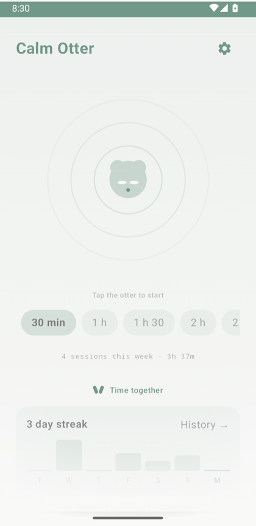
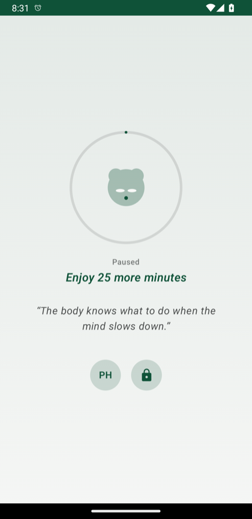
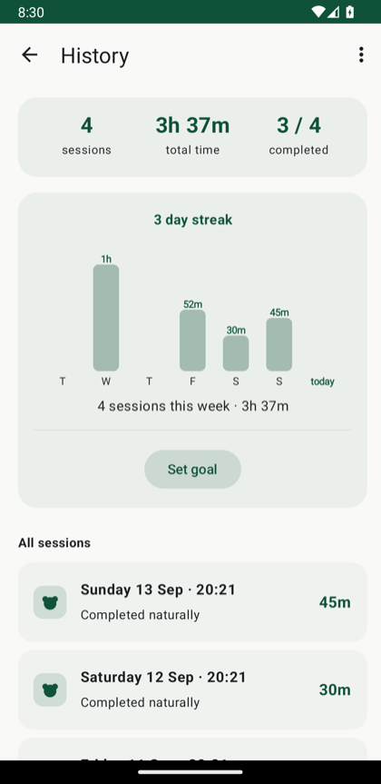
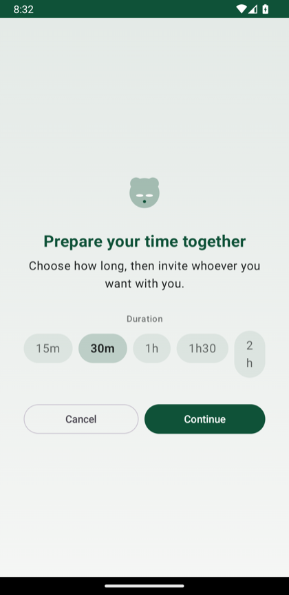

# Calm Otter

A native Android app that helps you put the phone down. Start a pause and
every app except Phone is blocked and notifications go quiet — only the
person who set the password can end it early. No account, no backend, no
analytics: everything happens on the device.

<p align="center">
  
  
  
  
</p>

## How it works

1. **First run** — the other person (the "accountability partner") opens
   the app and sets the password. It's saved as a PBKDF2-HMAC-SHA256 hash
   with a random salt inside `EncryptedSharedPreferences`, encrypted via
   Android Keystore — the plain-text password is never stored.
2. **Grant permissions** (one-time) — Accessibility + Notification Policy
   Access (Do Not Disturb).
3. **Start a pause** — choose a duration and tap the otter. From that
   moment: any app that isn't allowed gets covered by a full-screen block
   with a countdown, Do Not Disturb silences notifications, and a system
   alarm guarantees the session ends on time even if you never touch the
   phone again.
4. **End the pause** — automatically when time is up, or earlier if the
   correct password is entered on the block screen.

## Extra Allowed Apps

Beyond the Phone app, you can allow a small list of other apps to stay
usable during a pause — maps, a family group chat, whatever is
non-negotiable. Managing that list requires the password, so only the
accountability partner can add or remove apps.

## Home App

Calm Otter can also be set as your phone's Home app. With that on, the
Home button itself gets caught during an active session instead of just
being another way to escape to app icons — closing the most obvious
loophole in the block. It's optional and doesn't replace the
Accessibility service; see "Known Limits" below for why neither one is
airtight on its own.

## Tempo Insieme (Group Pause)

Two or more people can start the *same* pause together, each on their own
phone. From Home, "Time together" opens two roles, each with two ways to
pair:

- **QR / manual code** — fully offline: the host generates a code (also
  shown as a QR) that encodes the duration and an agreed start time; the
  other person scans it or types it in. No live connection at any point —
  the phones never talk to each other, they just start at the same
  pre-agreed moment.
- **Live lobby (Bluetooth, with NFC as a shortcut)** — the host opens a
  live lobby; the other person either taps their phone against the host's
  (NFC) or searches for it manually, then the host starts once at least
  one person has joined. The phones briefly connect only to agree on when
  to start — the connection ends the moment the pause itself begins.

This is why the app asks for a few extra permissions beyond
Accessibility/Do Not Disturb: **Camera** (to scan a QR) and
**Bluetooth + NFC** (for the live lobby). None of them enable any network
call or data collection — everything stays between the two phones
involved, or doesn't leave the device at all in the QR/code case.

## Known Limits of this version ("soft" block)

On Android, without being the *Device Owner* (MDM-style provisioning),
there is no truly user-proof block, and Calm Otter doesn't pretend
otherwise:

- The Accessibility service can be turned off from Settings at any time,
  without a password.
- Booting in Safe Mode prevents third-party accessibility services from
  loading at all.
- Setting Calm Otter as the Home app can always be undone from
  Settings > Apps > Default apps > Home — same mechanism, same limit as
  Accessibility above.
- While idle and set as Home, Calm Otter forwards to your previous
  launcher without handing back the Home role, which can make that
  launcher show its own "set as default" nag or restrict some features.
  This is an unavoidable side effect of how Android's `RoleManager` works
  and is left as-is rather than "fixed."

For a genuinely hard block, the app would need Device Owner provisioning
and Lock Task Mode with `DISALLOW_CONFIGURE_ACCESSIBILITY`,
`DISALLOW_SAFE_BOOT`, and `DISALLOW_UNINSTALL_APPS` — a significant jump
in invasiveness and complexity, left for a possible v2 if the soft block
proves insufficient in practice.

## Possible Evolutions

- Device Admin (not Device Owner) to make uninstallation harder during an
  active session.
- Remote unlock (would require a small backend) instead of only local.
- Named participants in a group pause's block screen/history — currently
  generic, since the QR/code pairing mode has no live channel to learn
  names from, and the live-lobby mode doesn't carry them forward past the
  lobby yet.

## License

MIT — see [LICENSE](LICENSE).

---

## For developers

### Project Structure

```
otter.git/
├── app/
│   ├── build.gradle.kts        # beta/stable product flavors, see CLAUDE.md
│   └── src/
│       ├── main/
│       │   ├── AndroidManifest.xml
│       │   ├── java/com/calmotter/app/
│       │   └── res/
│       ├── beta/                # app_name override for the beta flavor
│       └── test/                # Robolectric unit tests
├── specs/                        # as-built requirements.md + design.md per feature
├── docs/screenshots/
├── build.gradle.kts
└── settings.gradle.kts
```

See `CLAUDE.md` for the full architecture rundown (Compose UI, the
`SessionManager`/`PasswordManager`/etc. singleton pattern, DND/alarm
flow) and `specs/README.md` for the index of feature specs.

### Building

```bash
./gradlew assembleDebug                                  # both flavors' debug APKs
./gradlew testStableDebugUnitTest testBetaDebugUnitTest  # unit tests (Robolectric)
./gradlew lintStableDebug lintBetaDebug                  # Android Lint (0 errors, CI-enforced)
```

Two flavors exist on a `channel` dimension so a beta build can sit
installed side by side with the "real" app on the same device:

- **`stable`** — `com.calmotter.app`, no suffix. The one that matters.
- **`beta`** — `com.calmotter.app.beta`, "Calm Otter Beta" in the
  launcher.

Open the project root with Android Studio (Hedgehog or later) and let it
sync; `gradlew` is generated on first sync if not already present.

CI (`.github/workflows/ci.yml`) runs lint + unit tests for both flavors
and `assembleDebug` on every branch/PR.
