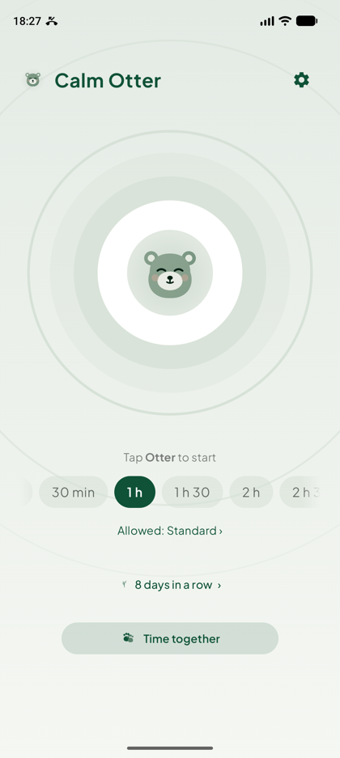
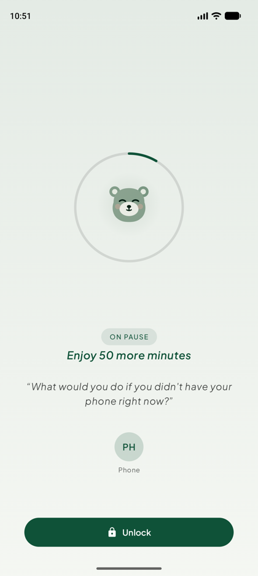
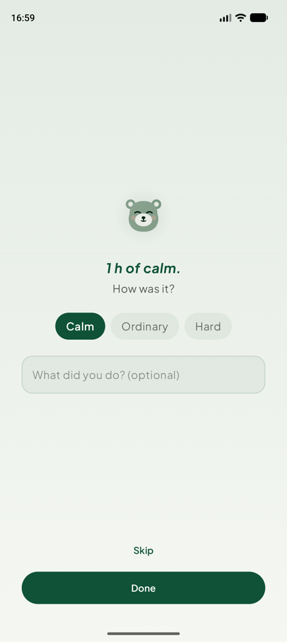
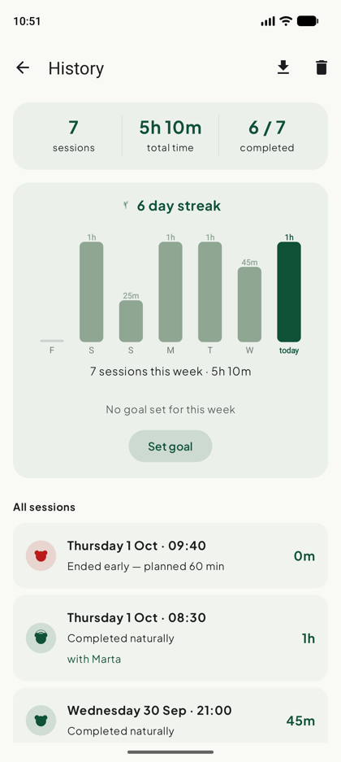
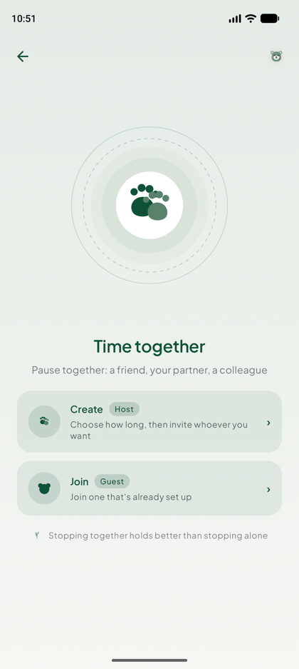

# Calm Otter

Put the phone down, on purpose. Calm Otter blocks every app but Phone and
silences notifications for as long as you choose — and only the person who
holds the password can end it early. No sign-up, no backend, no tracking:
just you, your phone, and a bit of quiet.

<p align="center">
  
  
  
  
  
</p>

## How it works

1. **Set a password** — you, or someone you trust to hold you accountable,
   opens the app and sets it once. It's kept as a PBKDF2-HMAC-SHA256 hash
   with a random salt inside `EncryptedSharedPreferences`, encrypted via
   Android Keystore — the actual password is never stored anywhere.
2. **Grant two permissions** — Accessibility and Do Not Disturb access.
   That's the whole setup, one time only.
3. **Pick a duration and tap the otter** — from a 10-minute breather to
   four hours; the app remembers the one you chose last. Or start it from
   the home-screen widget or the "Calm Otter" Quick Settings tile, which
   is there even when you're already deep in another app. Every app but
   Phone gets covered
   by a calm full-screen countdown, notifications go quiet — calls, alarms
   and whatever you're listening to still get through — and the pause is
   backed by a system alarm, so it ends on time even if you never touch
   the phone again.
4. **The pause ends itself** when time's up, or earlier if the right
   password is entered on the block screen. If the password can't be
   reached, there's also a slower way out: wait 10 minutes and the pause
   ends, marked in History as ended without password. It's on by default
   and only the password holder can switch it off.

## Extra Allowed Apps

Not everything needs to wait. Keep a short list of apps that stay
reachable during a pause — maps, a family chat, whatever is
non-negotiable. Different pauses can allow different things: a "Work"
list with Maps and the team chat, an "Evening" one with nothing at all.
Only the password holder can create or change these lists, so they stay
a deliberate exception, not a loophole; picking which one to use for the
next pause is a single tap on Home.

## Scheduled Pauses

The best moment to start a pause is the one you'd rather skip. Set it once
— "weekdays at 21:00 for an hour", "Sunday morning, two hours" — and it
starts by itself, with a quiet heads-up five minutes before. Adding a
schedule or making it stricter is free; switching it off, shortening it,
moving it later or skipping tonight needs the password. That's the pact.

## Small Rituals

- **A breathing pause.** Ten minutes, for the tense moments: the ring
  slowly expands and contracts and the screen just says *Breathe in*,
  *Breathe out* — no clock to watch.
- **How was it?** When a pause runs its full course, one gentle question:
  calm, ordinary or hard, plus a few words if you like ("walk by the
  lake"). It ends up in History next to that pause. Never after a pause
  cut short — it's a nod to time well spent, not a reproach.
- **A Sunday evening note.** Once a week, "This week: 7 pauses of calm."
  Only the count, never hours, streaks, goals or comparisons, and nothing
  at all if there were no pauses. One switch in Settings turns it off.

## Home App

For an even quieter phone, set Calm Otter as your Home app. Now the Home
button itself is part of the pause instead of a side door back to your
app icons. It's optional, and it doesn't replace Accessibility — see
"Known Limits" below for why the two work together rather than either
one being enough alone.

## Time Together (Group Pause)

Some pauses are better together. "Time together" lets two or more people
start the *same* pause at the *same* moment, each on their own phone —
made for a couple, a family, or a team that wants to disconnect as one:

- **QR / manual code** — fully offline. The host shares a code (or a QR)
  with the duration and an agreed start time baked in; everyone else
  scans or types it in. The phones never actually talk to each other —
  they just agree in advance and start together.
- **Live lobby (Bluetooth, with NFC as a shortcut)** — the host opens a
  lobby, everyone else joins with a tap (NFC) or a quick search, and the
  host starts once people are in. The phones connect just long enough to
  agree on a start time, then disconnect the moment the pause begins.

Everyone in the pause sees who they're with ("Together with Marta") on
the block screen, and the pause shows up with those names in History.

**Something to do together.** A shared pause takes the phones away and can
leave a silence: "so, what now?". The host gets a suggestion that fits the
length — *Let's take a long walk, no destination*, *Let's play a game of
cards*, or simply *Nothing: let's just be together* — and can ask for
another one. Everyone sees the same suggestion, in their own language,
during the pause. History then keeps a small icon of what kind of thing
you did, and a "Together" card adds it up: *Marta · 6 h in 4 pauses*.

**Ending it together.** If the person who started the shared pause
unlocks it early, their phone offers to release the others: hold the
phones together (NFC) and the other pauses end too, without anyone having
to know a password. That deliberately bypasses the other person's own
password — the authorisation is being in the same room plus the host's
explicit gesture, and it only ever works on that same shared pause. If
the pause simply runs out, there's nothing to release: every phone
finishes on its own.

That's why Calm Otter asks for a couple of extra permissions here —
**Camera** to scan a QR, **Bluetooth + NFC** for the live lobby — and
why it's worth saying plainly: none of it goes anywhere. No network
calls, no data collection. It stays between the phones in the room, or
never leaves the device at all in the QR/code case.

## Known Limits of this version ("soft" block)

On Android, without being the *Device Owner* (MDM-style provisioning),
there is no truly user-proof block, and Calm Otter doesn't pretend
otherwise:

- The Accessibility service can be turned off from Settings at any time,
  without a password.
- Booting in Safe Mode prevents third-party accessibility services from
  loading at all.
- Setting Calm Otter as the Home app can always be undone from
  Settings > Apps > Default apps > Home — same mechanism, same limit as
  Accessibility above.
- While idle and set as Home, Calm Otter forwards to your previous
  launcher without handing back the Home role, which can make that
  launcher show its own "set as default" nag or restrict some features.
  This is an unavoidable side effect of how Android's `RoleManager` works
  and is left as-is rather than "fixed."
- A scheduled pause starts on time and blocks as usual, but Android may
  not let it show its ongoing notification until the app is next opened:
  a background start is only allowed for exact alarms, which need a
  permission Calm Otter doesn't ask for.
- The slow exit (wait 10 minutes instead of typing the password) is a
  deliberate, softer way out. It's on by default, said in onboarding, and
  only the password holder can switch it off.

For a genuinely hard block, the app would need Device Owner provisioning
and Lock Task Mode with `DISALLOW_CONFIGURE_ACCESSIBILITY`,
`DISALLOW_SAFE_BOOT`, and `DISALLOW_UNINSTALL_APPS` — a significant jump
in invasiveness and complexity, left for a possible v2 if the soft block
proves insufficient in practice.

## Possible Evolutions

- Device Admin (not Device Owner) to make uninstallation harder during an
  active session.
- Remote unlock (would require a small backend) instead of only local.

## Privacy

Calm Otter has no `INTERNET` permission and collects nothing: see the
[privacy policy](docs/privacy-policy.md). Material for publishing on Google
Play (listing texts, graphics, declarations, checklist) is in
[`docs/store/`](docs/store/README.md).

## License

MIT — see [LICENSE](LICENSE).

---

## For developers

### Project Structure

```
otter.git/
├── app/
│   ├── build.gradle.kts        # beta/stable product flavors, see CLAUDE.md
│   └── src/
│       ├── main/
│       │   ├── AndroidManifest.xml
│       │   ├── java/com/calmotter/app/
│       │   └── res/
│       ├── beta/                # app_name override for the beta flavor
│       └── test/                # Robolectric unit tests
├── specs/                        # as-built requirements.md + design.md per feature
├── docs/screenshots/
├── build.gradle.kts
└── settings.gradle.kts
```

See `CLAUDE.md` for the full architecture rundown (Compose UI, the
`SessionManager`/`PasswordManager`/etc. singleton pattern, DND/alarm
flow) and `specs/README.md` for the index of feature specs.

### Building

```bash
./gradlew assembleDebug                                  # both flavors' debug APKs
./gradlew testStableDebugUnitTest testBetaDebugUnitTest  # unit tests (Robolectric)
./gradlew lintStableDebug lintBetaDebug                  # Android Lint (0 errors, CI-enforced)

# Screenshot tests run with the unit tests; after an intentional visual
# change, re-record the reference images and commit them:
./gradlew testStableDebugUnitTest --tests "*ScreenshotTest*" -Pscreenshots.record=true
```

Two flavors exist on a `channel` dimension so a beta build can sit
installed side by side with the "real" app on the same device:

- **`stable`** — `com.calmotter.app`, no suffix. The one that matters.
- **`beta`** — `com.calmotter.app.beta`, "Calm Otter Beta" in the
  launcher.

Open the project root with Android Studio (Hedgehog or later) and let it
sync; `gradlew` is generated on first sync if not already present.

CI (`.github/workflows/ci.yml`) runs lint + unit tests for both flavors
and `assembleDebug` on every branch/PR.
